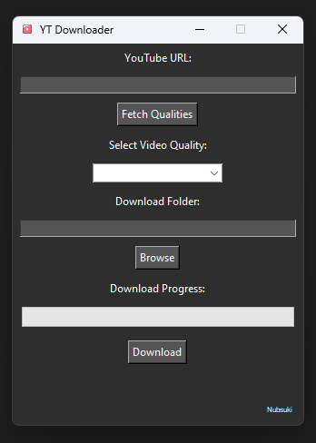

---

# YouTube Video Downloader

A simple and easy-to-use application to download YouTube videos. Just follow these steps:

### How to Use:
1. **Enter Video URL**: Copy the YouTube video URL and paste it into the URL input field.
2. **Fetch Qualities**: Click the **Fetch Qualities** button. Wait until the button becomes active (black) again, indicating that it has finished fetching the available video qualities.
3. **Select Quality**: Choose your desired video quality from the dropdown menu.
4. **Choose Download Location**: Select the folder where you want to save the downloaded video.
5. **Download Video**: Click the **Download** button to start the download process.

---

### Why I Made This
I created this application because most websites and applications for downloading YouTube videos require payment or subscriptions. As a hobbyist video editor, I wanted a free and straightforward solution. Although I don't have much experience with Python, I managed to build this thanks to the little help of AI.

---

### Latest Release
You can download the latest version of the application from the **Releases** section on this GitHub repository. Simply download and run the executable to get started.

---
## Disclaimer
This tool is intended for downloading content that you have permission to download. It is the user's responsibility to ensure compliance with copyright laws and YouTube's Terms of Service. The creator of this tool is not liable for any misuse.

---
## License
This project is for personal use and is distributed "as-is".

---
